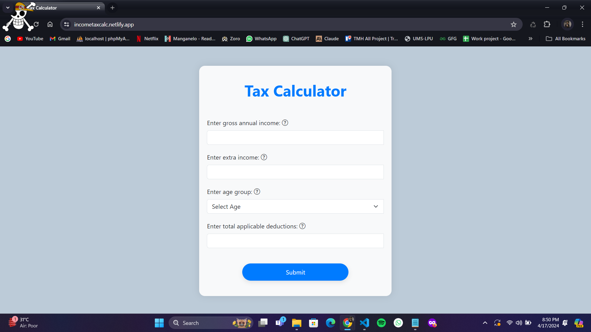
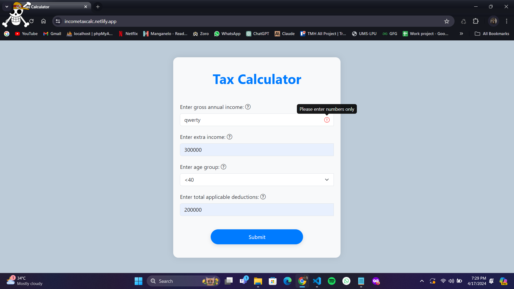

# Fyle Challenge - Tax Calculator

This is a web application developed as part of the Fyle Internship Challenge. It allows users to calculate their tax based on their income, age group, and deductions.

## Features

- Calculate tax based on gross income, extra income, age group, and deductions.
- Display the tax amount and overall income after tax deductions.
- Error handling for invalid input.
- Responsive design for use on various devices.

## Installation

1. Clone the repository to your local machine:

git clone https://github.com/david4u17/Fyle-challenge.git

2. Navigate to the project directory:

cd Fyle-challenge

3. Open the `index.html` file in your preferred web browser.

## Usage

1. Enter your gross annual income, extra income, select your age group, and enter total applicable deductions.
2. Click on the "Calculate Tax" button.
3. If there are any errors in the input fields, error icons will be displayed next to the respective fields.
4. Review the tax calculation result displayed in the modal.
5. Close the modal by clicking the "Close" button or outside the modal.

## Technologies Used

- HTML
- CSS
- JavaScript
- Bootstrap (v5.3.0-alpha1)

## Contributors

- [David Kawadkar](https://github.com/david4u17)

## Screenshot of Passing Tests

#Income Tax Calculator

 - Error-icon is not visible by default
   

 
 - If user put characters in input field then the error-icon will appear next to the field
 

 

- When you hover on (?) icon you can see the field details in the tooltip.

 

  - If user has not entered any value and clicks on submit, show a error icon hovering over which should show that input field is mandatory

 

 

# The age dropdown field should have 3 values -
   - <40
   - ≥ 40 & < 60
   - ≥ 60

       

  

- Do not restrict user from entering incorrect values like characters in the number fields but will show error icon if the value is not a number.

  

# Income over 8 (>) Lakhs, the amount over 8 Lakhs is taxed at

  - 30% for people with age < 40
  - Example
    - Age = 34, Income = 08 Lakhs, Extra Income = 03 Lakhs, deductions = 02 Lakhs, tax = .3 * (9 - 8) = .3 * 1 = Rs. 30,000
   
  - Clicking on submit should show a modal which would show the final values based on above calculations.

    

  - 40% for people with age ≥ 40 but < 60

    

  - 10% for people with age ≥ 60

