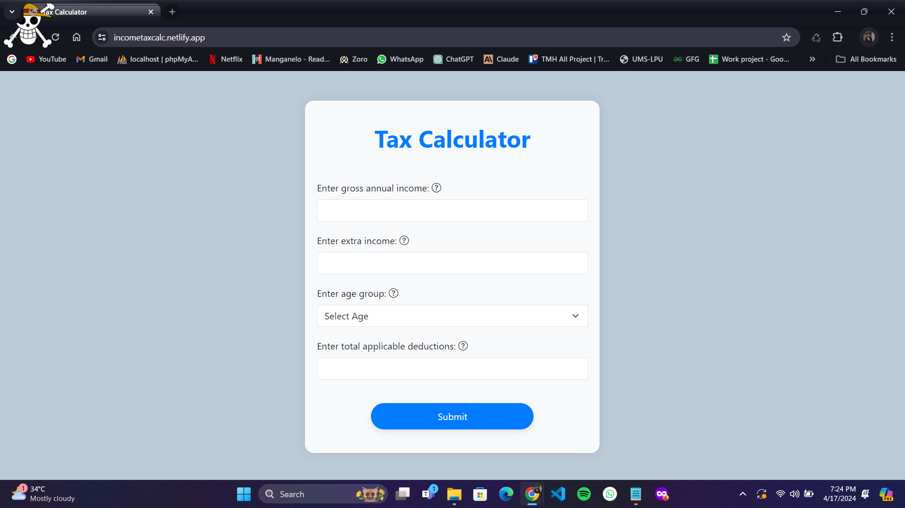

# Fyle Challenge - Tax Calculator

This is a web application developed as part of the Fyle Internship Challenge. It allows users to calculate their tax based on their income, age group, and deductions.

## Features

- Calculate tax based on gross income, extra income, age group, and deductions.
- Display the tax amount and overall income after tax deductions.
- Error handling for invalid input.
- Responsive design for use on various devices.

## Installation

1. Clone the repository to your local machine:

git clone https://github.com/david4u17/Fyle-challenge.git

2. Navigate to the project directory:

cd Fyle-challenge

3. Open the `index.html` file in your preferred web browser.

## Usage

1. Enter your gross annual income, extra income, select your age group, and enter total applicable deductions.
2. Click on the "Calculate Tax" button.
3. If there are any errors in the input fields, error icons will be displayed next to the respective fields.
4. Review the tax calculation result displayed in the modal.
5. Close the modal by clicking the "Close" button or outside the modal.

## Technologies Used

- HTML
- CSS
- JavaScript
- Bootstrap (v5.3.0-alpha1)

## Contributors

- [David Smith](https://github.com/david4u17)

## Screenshot of Passing Tests

